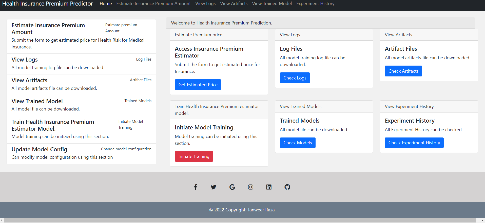
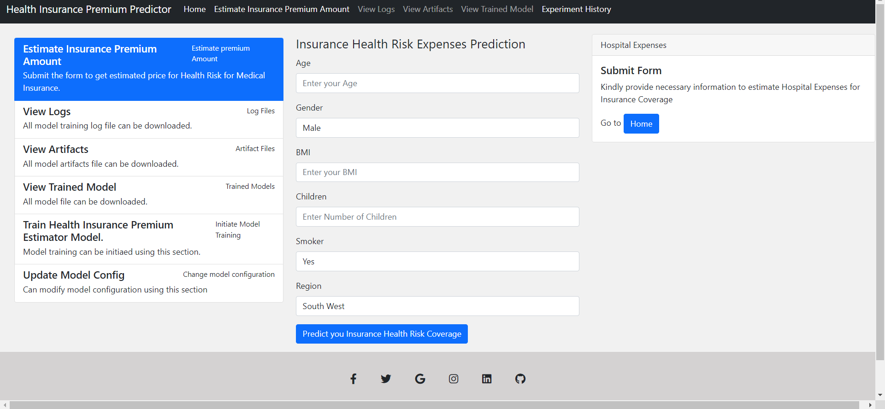
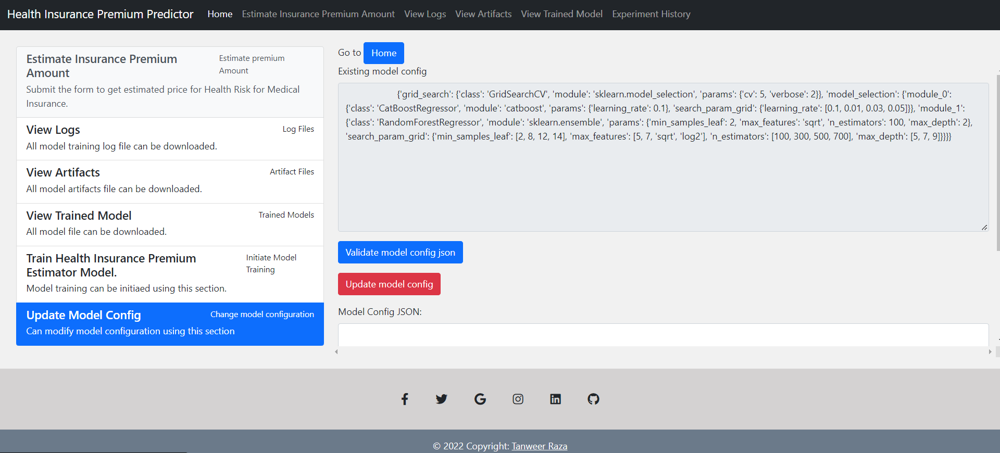
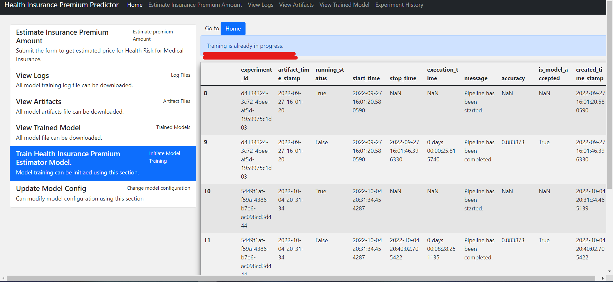

Insurence_premium_prediction project
## `insurance_premium` is the main package folder which contains. 

**Artifact** : Stores all artifacts created from running the application.

**Components** : Contains all components of Machine Learning Project
- DataIngestion
- DataValidation
- DataTransformations
- ModelTrainer
- ModelEvaluation
- ModelPusher

**Custom Exceptions and Logger** are used in this Project for better debugging purposes.

## 📷 Application Screenshots

### **This is the screenshot of the Home Webpage which has been done using the Flask**

### **This is the screenshot of the webpage which gets user input for prediction**

### **This is the screenshot of the page in which user can change the model parameters for the experiment**

### **This is the screenshot of the page in which user can train the model with update new parameters in Update Model Config section**

## Conclusion

This Project which predicts the amount of the insurance premium based on different parameters (like Age,BMI etc) for a particular person can be implemented practically and used by Insurance Comapnies in real life. This will help the companies to predict the estimate for Insurance premium for a particular person by considering the risk involved for that particular person. 

